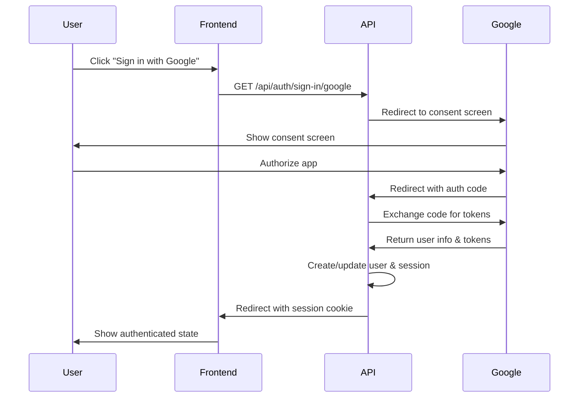

## Overview

The Inmobiliaria API supports Google OAuth 2.0 authentication, allowing users to sign in with their Google account without creating a separate password. This provides a seamless authentication experience and leverages Google's security infrastructure.

## Google OAuth Configuration

OAuth is configured in `src/auth/index.ts`:

```typescript
socialProviders: {
  google: {
    clientId: process.env.GOOGLE_CLIENT_ID,
    clientSecret: process.env.GOOGLE_CLIENT_SECRET,
  },
}
```

## Prerequisites

Before implementing Google OAuth, you need to set up a Google Cloud project:

<Steps>
  <Step title="Create Google Cloud Project">
    1. Go to [Google Cloud Console](https://console.cloud.google.com/)
    2. Create a new project or select an existing one
    3. Enable the Google+ API for your project
  </Step>
  
  <Step title="Configure OAuth Consent Screen">
    1. Navigate to **APIs & Services** > **OAuth consent screen**
    2. Select **External** user type (or Internal for Google Workspace)
    3. Fill in the required information:
       - App name: "Ramirez Inmuebles" (or your app name)
       - User support email
       - Developer contact email
    4. Add scopes: `email`, `profile`, `openid`
    5. Add test users if in development mode
  </Step>
  
  <Step title="Create OAuth Credentials">
    1. Go to **APIs & Services** > **Credentials**
    2. Click **Create Credentials** > **OAuth client ID**
    3. Select **Web application**
    4. Add authorized redirect URIs:
       ```
       http://localhost:3000/api/auth/callback/google (development)
       https://api.yourdomain.com/api/auth/callback/google (production)
       ```
    5. Save the **Client ID** and **Client Secret**
  </Step>
  
  <Step title="Set Environment Variables">
    Add the credentials to your `.env` file:
    ```bash
    GOOGLE_CLIENT_ID=your-client-id.apps.googleusercontent.com
    GOOGLE_CLIENT_SECRET=your-client-secret
    ```
  </Step>
</Steps>

<Warning>
Never commit your Google Client Secret to version control. Keep it secure in environment variables.
</Warning>

## OAuth Flow

The Google OAuth flow consists of three main steps:

<Steps>
  <Step title="Initiate OAuth">
    User clicks "Sign in with Google" and is redirected to Google's consent screen
  </Step>
  
  <Step title="User Grants Permission">
    User authorizes the application to access their Google profile information
  </Step>
  
  <Step title="Callback & Session Creation">
    Google redirects back to the API with an authorization code, which is exchanged for user information and a session is created
  </Step>
</Steps>

### Flow Diagram



## Implementation

### Initiate Google Sign-In

Redirect users to the Google OAuth endpoint:

```bash GET /api/auth/sign-in/google
GET https://api.yourdomain.com/api/auth/sign-in/google?callbackURL=https://yourdomain.com/dashboard
```

<ParamField query="callbackURL" type="string">
  URL to redirect to after successful authentication (defaults to `FRONTEND_URL`)
</ParamField>

<Info>
This endpoint automatically redirects to Google's OAuth consent screen. It should be opened in the same browser window (not via AJAX).
</Info>

### OAuth Callback

After user authorization, Google redirects to:

```
GET /api/auth/callback/google?code=AUTHORIZATION_CODE&state=STATE_TOKEN
```

Better Auth handles this automatically. You don't need to implement this endpoint.

### Session Creation

On successful authentication:

1. Better Auth exchanges the authorization code for user information
2. Creates or updates the user in the database
3. Creates a new session
4. Sets the session cookie
5. Redirects to the `callbackURL`

### User Data Stored

When a user signs in with Google, the following data is stored:

<ResponseField name="user" type="object">
  <Expandable title="User Object">
    <ResponseField name="id" type="string">
      Unique user ID generated by Better Auth
    </ResponseField>
    <ResponseField name="email" type="string">
      User's Google email address
    </ResponseField>
    <ResponseField name="name" type="string">
      User's full name from Google profile
    </ResponseField>
    <ResponseField name="image" type="string">
      URL to user's Google profile picture
    </ResponseField>
    <ResponseField name="emailVerified" type="boolean">
      Set to `true` (Google emails are pre-verified)
    </ResponseField>
    <ResponseField name="role" type="string">
      Set to `"user"` by default
    </ResponseField>
  </Expandable>
</ResponseField>

<ResponseField name="account" type="object">
  <Expandable title="OAuth Account">
    <ResponseField name="providerId" type="string">
      Set to `"google"`
    </ResponseField>
    <ResponseField name="accountId" type="string">
      User's Google account ID
    </ResponseField>
    <ResponseField name="accessToken" type="string">
      OAuth access token (encrypted)
    </ResponseField>
    <ResponseField name="refreshToken" type="string">
      OAuth refresh token (encrypted, if provided)
    </ResponseField>
    <ResponseField name="idToken" type="string">
      Google ID token (encrypted)
    </ResponseField>
  </Expandable>
</ResponseField>

## Client Implementation

<CodeGroup>
```typescript React
import { useEffect } from 'react';

function GoogleSignIn() {
  const handleGoogleSignIn = () => {
    // Store intended destination
    const callbackURL = '/dashboard';
    
    // Redirect to Google OAuth
    window.location.href = 
      `https://api.yourdomain.com/api/auth/sign-in/google?callbackURL=${encodeURIComponent(
        window.location.origin + callbackURL
      )}`;
  };

  return (
    <button onClick={handleGoogleSignIn}>
      
      Sign in with Google
    </button>
  );
}

export default GoogleSignIn;
```

```html Plain HTML
<a href="https://api.yourdomain.com/api/auth/sign-in/google?callbackURL=https://yourdomain.com/dashboard" 
   class="google-signin-btn">
  
  Sign in with Google
</a>
```

```vue Vue.js
<template>
  <button @click="signInWithGoogle">
    
    Sign in with Google
  </button>
</template>

<script setup>
const signInWithGoogle = () => {
  const callbackURL = '/dashboard';
  const baseURL = 'https://api.yourdomain.com';
  
  window.location.href = 
    `${baseURL}/api/auth/sign-in/google?callbackURL=${encodeURIComponent(
      window.location.origin + callbackURL
    )}`;
};
</script>
```
</CodeGroup>

<Tip>
Use Google's official [Sign-In Button Generator](https://developers.google.com/identity/branding-guidelines) to create brand-compliant buttons.
</Tip>

## Handling OAuth Callback

On your frontend callback page, check for the session:

```typescript
// pages/dashboard.tsx
import { useEffect, useState } from 'react';

function Dashboard() {
  const [user, setUser] = useState(null);
  const [loading, setLoading] = useState(true);

  useEffect(() => {
    // Check if user is authenticated after OAuth redirect
    fetch('https://api.yourdomain.com/api/session', {
      credentials: 'include'
    })
      .then(res => res.json())
      .then(data => {
        if (data.success && data.data) {
          setUser(data.data.user);
        }
        setLoading(false);
      })
      .catch(err => {
        console.error('Session check failed:', err);
        setLoading(false);
      });
  }, []);

  if (loading) return <div>Loading...</div>;
  if (!user) return <div>Not authenticated</div>;

  return (
    <div>
      <h1>Welcome, {user.name}!</h1>
      
      <p>{user.email}</p>
    </div>
  );
}
```

## Account Linking

If a user signs up with email/password and later signs in with Google using the same email address, Better Auth will:

1. Link the Google account to the existing user
2. Add a new record in the `accounts` table
3. Update the user's profile picture if they don't have one

<Note>
The `emailVerified` field is automatically set to `true` when linking a Google account.
</Note>

## Security Considerations

<AccordionGroup>
  <Accordion title="Token Storage" icon="key">
    OAuth tokens (access, refresh, ID tokens) are:
    - Stored encrypted in the `accounts` table
    - Never exposed to the frontend
    - Used only by the backend for Google API calls
    - Automatically refreshed when expired (if refresh token available)
  </Accordion>
  
  <Accordion title="State Parameter" icon="shield-halved">
    Better Auth automatically:
    - Generates a random state parameter for each OAuth request
    - Validates the state on callback to prevent CSRF attacks
    - Rejects requests with invalid or missing state
  </Accordion>
  
  <Accordion title="Redirect URI Validation" icon="link">
    Google validates that redirect URIs:
    - Match exactly what's configured in Google Cloud Console
    - Use HTTPS in production
    - Don't contain fragments or query parameters
    
    Always add your production callback URL to Google Cloud Console.
  </Accordion>
  
  <Accordion title="Scope Limitation" icon="eye-slash">
    The API only requests essential scopes:
    - `email`: User's email address
    - `profile`: Basic profile information (name, picture)
    - `openid`: OpenID Connect authentication
    
    No access to Gmail, Drive, or other Google services.
  </Accordion>
</AccordionGroup>

## Customizing OAuth Behavior

You can customize OAuth behavior by modifying the Better Auth configuration:

```typescript
socialProviders: {
  google: {
    clientId: process.env.GOOGLE_CLIENT_ID,
    clientSecret: process.env.GOOGLE_CLIENT_SECRET,
    
    // Optional: Request additional scopes
    scopes: ['email', 'profile', 'openid'],
    
    // Optional: Request offline access (refresh token)
    accessType: 'offline',
    
    // Optional: Force account selection
    prompt: 'select_account',
  },
}
```

<Warning>
Requesting additional scopes requires updating your Google Cloud Console OAuth consent screen configuration.
</Warning>

## Troubleshooting

<AccordionGroup>
  <Accordion title="Error: redirect_uri_mismatch" icon="triangle-exclamation">
    **Cause**: The redirect URI doesn't match what's configured in Google Cloud Console.
    
    **Solution**:
    1. Check your callback URL in Google Cloud Console
    2. Ensure it matches exactly: `https://api.yourdomain.com/api/auth/callback/google`
    3. Don't include trailing slashes or query parameters
    4. Wait a few minutes after updating (Google caches configurations)
  </Accordion>
  
  <Accordion title="Error: access_denied" icon="circle-xmark">
    **Cause**: User clicked "Cancel" or denied permissions.
    
    **Solution**: Handle this gracefully on your frontend:
    ```typescript
    // Check URL for error parameter
    const params = new URLSearchParams(window.location.search);
    if (params.get('error') === 'access_denied') {
      // Show message: "You must authorize the app to continue"
    }
    ```
  </Accordion>
  
  <Accordion title="Session not created after redirect" icon="cookie-bite">
    **Cause**: Cookies not being set or sent.
    
    **Solution**:
    - Ensure `credentials: 'include'` in fetch requests
    - Check CORS configuration allows credentials
    - Verify `SameSite=None` and `Secure=true` for cross-origin
    - Check browser console for cookie warnings
  </Accordion>
  
  <Accordion title="Error: invalid_client" icon="user-slash">
    **Cause**: Invalid Client ID or Client Secret.
    
    **Solution**:
    - Verify `GOOGLE_CLIENT_ID` and `GOOGLE_CLIENT_SECRET` in `.env`
    - Ensure credentials are from the correct Google Cloud project
    - Check for extra spaces or newlines in environment variables
    - Regenerate credentials if compromised
  </Accordion>
</AccordionGroup>

## Testing OAuth Locally

To test Google OAuth in development:

<Steps>
  <Step title="Add localhost to authorized origins">
    In Google Cloud Console, add:
    ```
    http://localhost:3000
    http://localhost:5173
    ```
  </Step>
  
  <Step title="Add localhost callback URL">
    ```
    http://localhost:3000/api/auth/callback/google
    ```
  </Step>
  
  <Step title="Use test users">
    If your OAuth consent screen is in testing mode, add your Google account as a test user.
  </Step>
  
  <Step title="Test the flow">
    ```bash
    # Start backend
    npm run dev
    
    # Visit in browser
    http://localhost:3000/api/auth/sign-in/google?callbackURL=http://localhost:5173/dashboard
    ```
  </Step>
</Steps>

<Tip>
For local development, you can use `http://` URLs. In production, always use `https://`.
</Tip>

## Next Steps

<CardGroup cols={2}>
  <Card title="Session Management" icon="clock-rotate-left" href="/auth/sessions">
    Learn how sessions work after OAuth authentication
  </Card>
  <Card title="Email/Password Auth" icon="envelope" href="/auth/email-password">
    Combine OAuth with traditional authentication
  </Card>
  <Card title="User Profile" icon="user" href="/api/users/profile">
    Access and update OAuth user information
  </Card>
  <Card title="Protected Routes" icon="shield-check" href="/api/authentication">
    Protect routes with authentication middleware
  </Card>
</CardGroup>